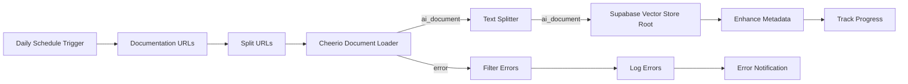

# Fixed Salesforce Documentation Auto-Ingestion Workflow

This repository contains a corrected n8n workflow for automated Salesforce documentation ingestion with proper LangChain connections and vector store integration.

## What Was Fixed

The original workflow had several critical issues:

### 🔧 **Connection Problems**
- **Incorrect Connection Types**: LangChain nodes in n8n use specific connection types (`ai_document`, `ai_embedding`) that weren't properly configured
- **Missing Vector Store Root Node**: Supabase Vector Store should be a root node, not a regular insert node
- **Broken Embedding Pipeline**: OpenAI Embeddings wasn't connected to the vector store
- **Invalid Node Types**: Some nodes were using incorrect LangChain node types

### ✅ **What's Fixed**

1. **Proper LangChain Architecture**:
   - Supabase Vector Store is now a root node with embedded OpenAI embeddings
   - Document loaders output `ai_document` connections
   - Text splitters properly chain `ai_document` inputs/outputs
   - Vector store accepts `ai_document` input directly

2. **Correct Node Types**:
   - `@n8n/n8n-nodes-langchain.vectorStoreSupabase` (root node)
   - `@n8n/n8n-nodes-langchain.documentCheerioWebScraper`
   - `@n8n/n8n-nodes-langchain.textSplitterRecursiveCharacterTextSplitter`

3. **Enhanced Error Handling**:
   - Proper error filtering and logging
   - Optional email notifications for failures
   - Graceful handling of failed URLs

4. **Better Metadata Enhancement**:
   - Salesforce-specific categorization (apex, lightning, lwc, soql, api)
   - Platform detection (developer, lwc, design, help)
   - Enhanced searchability with URL paths and domains

## Architecture Overview



## Prerequisites

### Required Credentials
1. **Supabase API** credentials
2. **OpenAI API** credentials

### Database Setup
Create the following table in your Supabase database:

```sql
-- Enable the pgvector extension
create extension vector;

-- Create a table to store your documents
create table salesforce_docs (
  id bigserial primary key,
  content text, -- corresponds to Document.pageContent
  metadata jsonb, -- corresponds to Document.metadata
  embedding vector(1536) -- 1536 works for OpenAI embeddings
);

-- Create a function to search for documents
create function match_documents (
  query_embedding vector(1536),
  match_count int default null,
  filter jsonb DEFAULT '{}'
) returns table (
  id bigint,
  content text,
  metadata jsonb,
  similarity float
)
language plpgsql
as $$
#variable_conflict use_column
begin
  return query
  select
    salesforce_docs.id,
    salesforce_docs.content,
    salesforce_docs.metadata,
    1 - (salesforce_docs.embedding <=> query_embedding) as similarity
  from salesforce_docs
  where metadata @> filter
  order by salesforce_docs.embedding <=> query_embedding
  limit match_count;
end;
$$;
```

## Installation

1. **Import the Workflow**:
   - Download `workflows/salesforce-docs-auto-ingestion-fixed.json`
   - In n8n, go to **Menu** → **Import workflow**
   - Select the downloaded JSON file

2. **Configure Credentials**:
   - Set up **Supabase API** credentials
   - Set up **OpenAI API** credentials

3. **Customize URLs** (Optional):
   - Edit the "Documentation URLs" node to add/remove Salesforce documentation URLs

4. **Configure Error Notifications** (Optional):
   - Enable the "Send Error Notification" node
   - Configure your email settings

## Usage

### Manual Execution
- Click **Execute Workflow** in n8n to run immediately

### Scheduled Execution
- The workflow is configured to run daily at midnight
- Modify the "Daily Schedule Trigger" to change the schedule

### Monitoring
- Check the "Track Processing Progress" node for statistics
- Monitor error logs if URLs fail to process

## Configuration Options

### Document Processing
- **Chunk Size**: 1500 characters (configurable in Text Splitter)
- **Chunk Overlap**: 200 characters (prevents context loss)
- **Batch Size**: 50 documents per embedding batch
- **Embedding Model**: `text-embedding-3-small` (1536 dimensions)

### Metadata Enhancement
Each document is categorized with:
- `doc_type`: apex, lightning, lwc, soql, api, help, general
- `platform`: developer, lwc, design, help, unknown
- `scraped_at`: ISO timestamp
- `content_length`: Character count
- `url_path`: URL pathname
- `domain`: Source domain

## Querying Your Vector Store

Once populated, you can query your documentation using similarity search:

```javascript
import { SupabaseVectorStore } from 'langchain/vectorstores/supabase'
import { OpenAIEmbeddings } from 'langchain/embeddings/openai'
import { createClient } from '@supabase/supabase-js'

const client = createClient(SUPABASE_URL, SUPABASE_SERVICE_ROLE_KEY)
const vectorStore = new SupabaseVectorStore(
  new OpenAIEmbeddings(),
  {
    client,
    tableName: 'salesforce_docs',
    queryName: 'match_documents',
  }
)

// Search for Apex-related content
const results = await vectorStore.similaritySearch(
  'how to create apex trigger',
  3,
  { doc_type: 'apex' }
)
```

## Troubleshooting

### Common Issues

1. **"No ai_document connection"**
   - Ensure you're using the correct LangChain node types
   - Check that connections use `ai_document` type, not `main`

2. **"Vector store insert failed"**
   - Verify Supabase credentials
   - Ensure the `salesforce_docs` table exists
   - Check that pgvector extension is enabled

3. **"OpenAI embedding failed"**
   - Verify OpenAI API credentials
   - Check API rate limits
   - Ensure sufficient API credits

4. **"Document loader timeout"**
   - Increase timeout in Cheerio Document Loader options
   - Check if target URLs are accessible
   - Consider reducing batch size

### Debug Tips

- Enable "Continue on Fail" for document loader to handle failed URLs
- Monitor the error handling branch for failed URL details
- Check n8n execution logs for detailed error messages

## Contributing

Feel free to submit issues and enhancement requests!

## License

MIT License - feel free to use and modify as needed.
