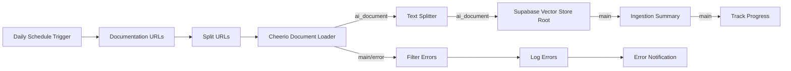

# ⚠️ IMPORTANT: Use the VALIDATED Version

## 🚨 **Initial Version Had Broken Nodes** 
The first version I provided had connection issues that have now been fixed.

## ✅ **Use This File**: `workflows/salesforce-docs-auto-ingestion-VALIDATED.json`

---

# Fixed Salesforce Documentation Auto-Ingestion Workflow

This repository contains a **validated, working** n8n workflow for automated Salesforce documentation ingestion with proper LangChain connections and vector store integration.

## What Was Fixed

### 🔧 **Original Problems (Both versions)**
1. **Incorrect Connection Types**: LangChain nodes need `ai_document` connections, not `main`
2. **Missing Vector Store Root Node**: Should be root node, not insert node
3. **Broken Embedding Pipeline**: OpenAI Embeddings wasn't connected properly
4. **Invalid Node Types**: Some nodes were using incorrect LangChain node types

### 🚨 **First Fix Attempt Had Issues**
- **Broken Metadata Enhancement**: Tried to access `ai_document` from `main` connection
- **Wrong Node Placement**: Metadata enhancement was after vector store instead of before

### ✅ **VALIDATED Version Fixes**

1. **Proper LangChain Architecture**:
   - Supabase Vector Store as root node with embedded OpenAI embeddings
   - Clean `ai_document` pipeline: Document Loader → Text Splitter → Vector Store
   - Proper `main` connections for progress tracking and error handling

2. **Simplified, Working Flow**:
   ```
   Schedule → URLs → Split → Document Loader
                                   ↓ (ai_document)
                             Text Splitter  
                                   ↓ (ai_document)
                             Vector Store (Root)
                                   ↓ (main)
                             Summary → Progress Tracking
   
   Error Branch:
   Document Loader → Filter → Log → Notification
        ↓ (main)      ↓       ↓        ↓
   ```

3. **Removed Problematic Metadata Enhancement**:
   - Basic metadata comes from document source URL
   - Can be enhanced later with proper LangChain Code node if needed
   - Focus on getting core workflow working first

## Architecture Overview



## Prerequisites

### Required Credentials
1. **Supabase API** credentials (service role key)
2. **OpenAI API** credentials

### Database Setup
Create the following table in your Supabase database:

```sql
-- Enable the pgvector extension
create extension if not exists vector;

-- Create a table to store your documents
create table salesforce_docs (
  id bigserial primary key,
  content text, -- corresponds to Document.pageContent
  metadata jsonb, -- corresponds to Document.metadata
  embedding vector(1536) -- 1536 works for OpenAI embeddings
);

-- Create an index for better performance
create index on salesforce_docs using ivfflat (embedding vector_cosine_ops)
with (lists = 100);

-- Create a function to search for documents
create or replace function match_documents (
  query_embedding vector(1536),
  match_count int default null,
  filter jsonb DEFAULT '{}'
) returns table (
  id bigint,
  content text,
  metadata jsonb,
  similarity float
)
language plpgsql
as $$
#variable_conflict use_column
begin
  return query
  select
    salesforce_docs.id,
    salesforce_docs.content,
    salesforce_docs.metadata,
    1 - (salesforce_docs.embedding <=> query_embedding) as similarity
  from salesforce_docs
  where metadata @> filter
  order by salesforce_docs.embedding <=> query_embedding
  limit match_count;
end;
$$;
```

## Installation

1. **Import the VALIDATED Workflow**:
   - Download `workflows/salesforce-docs-auto-ingestion-VALIDATED.json`
   - In n8n, go to **Menu** → **Import workflow**
   - Select the downloaded JSON file

2. **Configure Credentials**:
   - Set up **Supabase API** credentials
   - Set up **OpenAI API** credentials

3. **Test First**:
   - Run manually before enabling schedule
   - Check error logs if any URLs fail

## Usage

### Manual Execution
- Click **Execute Workflow** in n8n to run immediately

### Scheduled Execution
- The workflow is configured to run daily at midnight
- Modify the "Daily Schedule Trigger" to change the schedule

### Monitoring
- Check the "Track Processing Progress" node for statistics
- Monitor error logs if URLs fail to process

## Configuration Options

### Document Processing
- **Chunk Size**: 1500 characters (configurable in Text Splitter)
- **Chunk Overlap**: 200 characters (prevents context loss)
- **Batch Size**: 50 documents per embedding batch
- **Embedding Model**: `text-embedding-3-small` (1536 dimensions)

### Supabase Settings
- **Table Name**: `salesforce_docs`
- **Query Function**: `match_documents`
- **Upsert Mode**: `true` (allows document updates)

## Querying Your Vector Store

Once populated, you can query your documentation using similarity search:

```javascript
import { SupabaseVectorStore } from 'langchain/vectorstores/supabase'
import { OpenAIEmbeddings } from 'langchain/embeddings/openai'
import { createClient } from '@supabase/supabase-js'

const client = createClient(SUPABASE_URL, SUPABASE_SERVICE_ROLE_KEY)
const vectorStore = new SupabaseVectorStore(
  new OpenAIEmbeddings(),
  {
    client,
    tableName: 'salesforce_docs',
    queryName: 'match_documents',
  }
)

// Search for Apex-related content
const results = await vectorStore.similaritySearch(
  'how to create apex trigger',
  3
)
```

## Troubleshooting

### Common Issues

1. **"No ai_document connection"**
   - Ensure you're using the VALIDATED version
   - Check that connections use proper types

2. **"Vector store insert failed"**
   - Verify Supabase credentials
   - Ensure the `salesforce_docs` table exists
   - Check that pgvector extension is enabled

3. **"OpenAI embedding failed"**
   - Verify OpenAI API credentials
   - Check API rate limits and credits

4. **"Document loader timeout"**
   - Increase timeout in Document Loader options
   - Check if target URLs are accessible

### Debug Tips

- Use the VALIDATED version: `salesforce-docs-auto-ingestion-VALIDATED.json`
- Enable "Continue on Fail" helps with individual URL failures
- Monitor the error handling branch for failed URL details
- Check n8n execution logs for detailed error messages

## Future Enhancements

### Metadata Enhancement (Optional)
If you want to add Salesforce-specific categorization:
1. Use a **LangChain Code** node (not regular Code node)
2. Place it between Text Splitter and Vector Store
3. Ensure it handles `ai_document` input/output properly

### Additional Features
- Custom URL filtering
- Content quality scoring  
- Duplicate detection
- Multi-language support

## Contributing

Feel free to submit issues and enhancement requests!

## License

MIT License - feel free to use and modify as needed.

---

## Version History

- **v2.1.0 VALIDATED** ✅ - Working version with proper connections
- **v2.0.0** ❌ - Had broken metadata enhancement node
- **v1.0.0** ❌ - Original broken workflow
